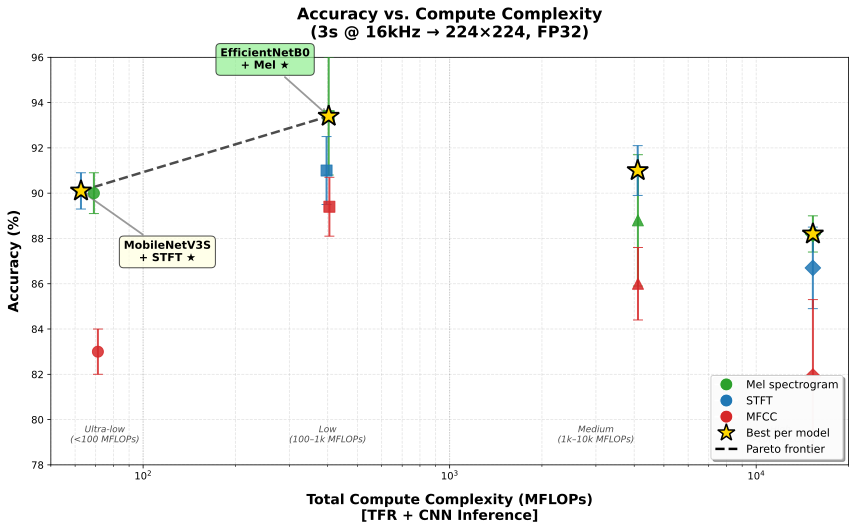

# SEAbird

Dataset creation and validation pipeline for Southeast Asian bird audio classification.

**Dataset:** The SEAbird dataset (6000 annotated 3-second segments, 10 species) is available on Zenodo: [](https://doi.org/10.5281/zenodo.18112566)

## Overview

End-to-end pipeline from Xeno-Canto downloads to optimized train/val/test splits:

1. **Download** recordings from Xeno-Canto (FLAC format)
2. **Annotate** bird vocalizations with interactive GUI
3. **Extract** 3-second segments
4. **Quality control** and filtering
5. **Split** with MIP optimization (prevents data leakage)

## Pipeline Stages

| Stage | Script                                     | Description                           |
| ----- | ------------------------------------------ | ------------------------------------- |
| 1     | `Stage1_xc_fetch_metadata.py`              | Fetch recording metadata              |
| 2     | `Stage2_xc_dload_all_from_species_list.py` | Download recordings                   |
| 3     | `Stage3_xc_dload_delta_by_id.py`           | Download specific IDs                 |
| 4     | `Stage4_eda_downloads.py`                  | Exploratory data analysis             |
| 5     | `Stage5_find_segments_interactive.py`      | Interactive annotation GUI            |
| 6     | `Stage6_extract_annotated_segments.py`     | Extract WAV segments                  |
| 7     | `Stage7_quality_control_selection.py`      | Quality control                       |
| 8a    | `Stage8a_splitter_mip.py`                  | **MIP-based splitting (recommended)** |
| 8b    | `Stage8b_splitter_genetic_algorithm.py`    | GA-based splitting                    |
| 8c    | `Stage8c_splitter_simulated_annealing.py`  | SA-based splitting                    |
| 9     | `Stage9_train_seabird_multifeature.py`       | Train 4 CNN models                    |

## MIP Splitter (Stage 8a)

Generates CSV-based splits with configurable ratios:

```bash
python Stage8a_splitter_mip.py /path/to/dataset \
    --train_ratio 0.80 --val_ratio 0.10 --test_ratio 0.10 \
    --output /path/to/splits.csv
```

**Output format:**
```csv
# split_ratio=80:10:10 seed=42 objective=0 solver=mip_cbc
filename,split
xc1002657_2860.wav,test
xc1003831_2642.wav,train
...
```

**Key features:**
- Source-based separation (same recording never in multiple splits)
- Perfect class balance (objective=0 means exact ratios achieved)
- Reproducible via seed parameter
- CSV output for use with any training framework

## Splitter Performance Comparison

Benchmark on 6000-sample dataset (10 classes, 1074 sources) with 3 split ratios:

| Algorithm | Avg Time | 75:10:15 | 80:10:10 | 70:15:15 | Solution Quality |
|-----------|----------|----------|----------|----------|------------------|
| **MIP** | **1.1s** | 1.17s | 1.24s | 1.03s | Optimal (objective=0) |
| GA | 7.5s | 3.72s | 3.04s | 15.59s | Optimal (objective=0) |
| SA | ~19 min | 19.2 min | 19.6 min | 17.6 min | Optimal (objective=0) |

**Recommendation:** Use MIP (Stage8a) for fastest results with guaranteed optimality.

## Pre-generated Splits

Ready-to-use splits for 6000-sample dataset (seed=42, all objective=0):

| File | Algorithm | Train | Val | Test |
|------|-----------|-------|-----|------|
| `seabird_splits_mip_75_10_15.csv` | MIP | 75% | 10% | 15% |
| `seabird_splits_mip_80_10_10.csv` | MIP | 80% | 10% | 10% |
| `seabird_splits_mip_70_15_15.csv` | MIP | 70% | 15% | 15% |
| `seabird_splits_ga_75_10_15.csv` | Genetic Algorithm | 75% | 10% | 15% |
| `seabird_splits_ga_80_10_10.csv` | Genetic Algorithm | 80% | 10% | 10% |
| `seabird_splits_ga_70_15_15.csv` | Genetic Algorithm | 70% | 15% | 15% |
| `seabird_splits_sa_75_10_15.csv` | Simulated Annealing | 75% | 10% | 15% |
| `seabird_splits_sa_80_10_10.csv` | Simulated Annealing | 80% | 10% | 10% |
| `seabird_splits_sa_70_15_15.csv` | Simulated Annealing | 70% | 15% | 15% |

## Training Results

Benchmark results using `Stage9_train_seabird_multifeature.py` with 4 CNN architectures, 3 feature types, and 3 random seeds (42, 100, 786). All models use ImageNet pretrained weights with 75:10:15 train/val/test split.

### Summary (Test Accuracy %)

| Model | Mel | STFT | MFCC | Best |
|-------|-----|------|------|------|
| **EfficientNetB0** | **93.4 ± 2.6** | 91.0 ± 1.5 | 89.4 ± 1.3 | **93.4%** |
| ResNet50 | 88.8 ± 2.9 | 91.0 ± 1.1 | 86.0 ± 1.6 | 91.0% |
| MobileNetV3S | 90.0 ± 0.9 | 90.1 ± 0.8 | 83.0 ± 1.0 | 90.1% |
| VGG16 | 88.2 ± 0.8 | 86.7 ± 1.8 | 81.9 ± 3.4 | 88.2% |



### Feature MFLOP Accounting

**Input:** 16kHz × 3s audio (48,000 samples) → 224×224 spectrogram

**Parameters:** N_FFT=2048, hop=214, 224 frames, 128 mel bins

| Operation | STFT | Mel | MFCC |
|-----------|------|-----|------|
| Framing + Windowing (224 × 2048) | 0.5 | 0.5 | 0.5 |
| FFT (224 frames × 5N log N) | 25.2 | 25.2 | 25.2 |
| Magnitude (224 × 1025 × 3 ops) | 0.7 | 0.7 | 0.7 |
| Mel Filterbank (sparse, ~20 weights/bin) | - | 5.1 | 5.1 |
| Log Compression (28K × 10 ops) | - | 0.3 | 0.3 |
| DCT-II (128 × 80 × 224 × 2) | - | - | 4.6 |
| **Total MFLOPs** | **26** | **32** | **36** |

### Total MFLOPs (CNN + Feature)

| Model          | Best Feature | CNN MFLOPs | Feature MFLOPs | **Total MFLOPs** | Accuracy (%) |
| -------------- | ------------ | ---------- | -------------- | ---------------- | ------------ |
| EfficientNetB0 | Mel          | 390        | 32             | **422**          | 93.4         |
| MobileNetV3S*  | Mel          | 60         | 32             | **92**           | 90.1         |
| ResNet50       | STFT         | 4100       | 26             | **4126**         | 91.0         |
| VGG16          | Mel          | 15500      | 32             | **15532**        | 88.2         |


### Key Findings

- **Best model:** EfficientNetB0 + Mel spectrogram (93.4% accuracy)
- **Best feature:** Mel spectrogram consistently outperforms STFT and MFCC
- **Most efficient:** MobileNetV3S + Mel (90.1% accuracy at 92 MFLOPs = 4.6× less compute than EfficientNetB0)
- **Most stable:** VGG16 + Mel (lowest variance across seeds)
- **MFCC:** Unsuitable for bird sounds (although it works well with speech processing)

### **CNN Ranking**

- **EfficientNetB0 + Mel** achieves highest accuracy (93.4%) at moderate compute.
- **MobileNetV3S + Mel** is optimal for edge deployment: 90.1% accuracy at just 92 MFLOPs.
- **ResNet50** is Pareto-dominated: much higher compute for marginal accuracy gain.
- **VGG16** is clearly inefficient.

### Detailed Results

| Model | Feature | Seed 42 | Seed 100 | Seed 786 | Mean | Std |
|-------|---------|---------|----------|----------|------|-----|
| EfficientNetB0 | Mel | 95.89 | 93.56 | 90.67 | 93.37 | 2.62 |
| EfficientNetB0 | STFT | 92.33 | 91.33 | 89.33 | 91.00 | 1.53 |
| EfficientNetB0 | MFCC | 90.33 | 90.00 | 87.89 | 89.41 | 1.33 |
| ResNet50 | Mel | 85.89 | 88.89 | 91.67 | 88.81 | 2.89 |
| ResNet50 | STFT | 91.78 | 89.67 | 91.44 | 90.96 | 1.13 |
| ResNet50 | MFCC | 84.33 | 87.56 | 86.22 | 86.04 | 1.62 |
| VGG16 | Mel | 87.89 | 87.67 | 89.11 | 88.22 | 0.78 |
| VGG16 | STFT | 87.89 | 87.56 | 84.56 | 86.67 | 1.84 |
| VGG16 | MFCC | 79.56 | 80.33 | 85.78 | 81.89 | 3.39 |
| MobileNetV3S | Mel | 90.33 | 90.67 | 88.89 | 89.96 | 0.95 |
| MobileNetV3S | STFT | 90.22 | 90.89 | 89.33 | 90.15 | 0.78 |
| MobileNetV3S | MFCC | 82.56 | 82.22 | 84.11 | 82.96 | 1.01 |


### MobileNetV3S Training Improvements

MobileNetV3S requires different hyperparameter settings.
The original MobileNetV3S results (63.5%) showed significant underfitting. An improved training strategy achieved **90.1% accuracy**:

| Change | Other CNNs | MobileNetV3S |
|--------|----------|----------|
| Warmup epochs | 5 | 10 |
| Fine-tuning scope | Top 20% layers | All layers |
| Fine-tune learning rate | 5e-5 | 1e-4 |
| Weight decay | 1e-4 | 1e-5 |
| Dropout (classifier) | 0.5/0.4 | 0.3/0.2 |
| Hidden units | 256 | 512 |
| Early stopping patience | 7 | 15 |

This demonstrates that MobileNetV3S is highly suitable for bird audio classification when properly trained, achieving near-EfficientNetB0 accuracy at 4.6× lower compute.

### Training Command

```bash
python Stage9_train_seabird_multifeature.py \
    --splits_csv ./seabird_splits_mip_75_10_15.csv \
    --model efficientnetb0 \
    --feature mel \
    --use_pretrained \
    --seed 42
```

For audio-focused CNN training, see also [mun3im/mynanet](https://github.com/mun3im/mynanet).

## Installation

```bash
pip install numpy scipy librosa soundfile requests tqdm matplotlib sounddevice pulp
```

## License

MIT
