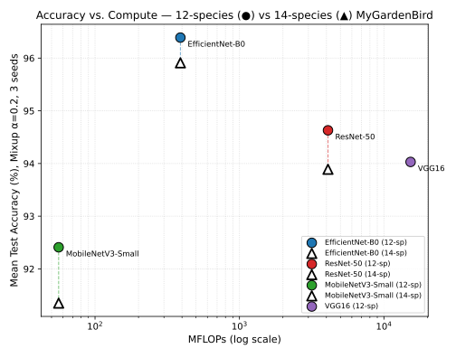

# Benchmark Summaries

Pretrained-CNN benchmarks for the MyGardenBird 16 kHz datasets. Each summary
covers 3 seeds (42, 100, 786) × 3 augmentation strategies (No Augmentation,
SpecAugment, Mixup α=0.2) on ImageNet-pretrained backbones fine-tuned on mel
spectrograms.

| Summary | Dataset | Species | Models | Experiments |
|---|---|---|---|---|
| [`16k_12species.md`](16k_12species.md) | MyGardenBird (core) | 12 | EfficientNet-B0, ResNet-50, VGG16, MobileNetV3-Small | 36/36 complete |
| [`plus_16k_14species.md`](plus_16k_14species.md) | MyGardenBird-Plus | 14 | EfficientNet-B0, ResNet-50, MobileNetV3-Small | 27/27 complete |

> VGG16 was only benchmarked on the 12-species core set; the 14-species Plus
> sweep covers the other three architectures.

## Accuracy vs. Compute

Best-configuration (Mixup α=0.2) mean test accuracy vs. MFLOPs for both
datasets, log-scaled on compute:



- ● = 12-species core, ▲ = 14-species Plus (dashed line connects the same
  architecture across datasets)
- **EfficientNet-B0** dominates the accuracy/compute trade-off on both
  datasets — highest accuracy at a fraction of ResNet-50/VGG16's MFLOPs.
- Adding 2 species (12→14) costs every shared architecture ≈0.5–1.1 pp,
  with the compute-accuracy ordering unchanged.
- **VGG16** sits far to the right (15,300 MFLOPs) yet still trails
  EfficientNet-B0 and ResNet-50 in accuracy, making it the least
  compute-efficient of the four.

| Model | MFLOPs | Params | 12-sp Acc (Mixup) | 14-sp Acc (Mixup) | Δ (12→14) |
|---|---|---|---|---|---|
| EfficientNet-B0 | 390 | 4.4M | **96.39%** | **95.91%** | −0.48 pp |
| ResNet-50 | 4,100 | 24.1M | 94.63% | 93.89% | −0.74 pp |
| VGG16 | 15,300 | 14.8M | 94.03% | — (not run) | — |
| MobileNetV3-Small | 56 | 1.2M | 92.41% | 91.35% | −1.06 pp |

## Regenerating the Plot

```bash
cd benchmark_summaries
python3 accuracy_vs_mflops_figure.py
```

The MFLOPs/accuracy figures in [`accuracy_vs_mflops_figure.py`](accuracy_vs_mflops_figure.py)
are transcribed from the tables above, which in turn come from the per-run
`results.json` files in
[`../results_16k_12sp_linux/`](../results_16k_12sp_linux/) and
[`../resultsplus_16k_linux/`](../resultsplus_16k_linux/).
